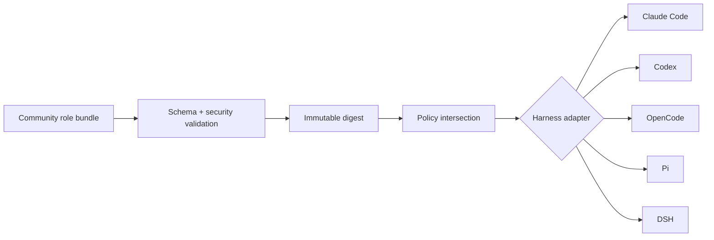
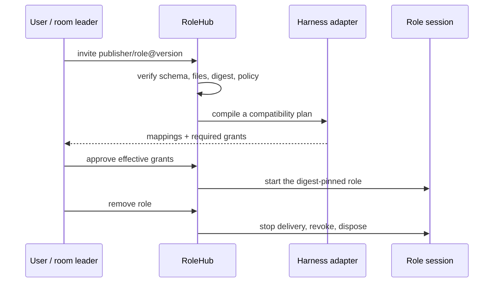

<div align="center">
  
  <h1>RoleHub</h1>
  <p><strong>One role. Any AI harness.</strong></p>
  <p>Portable, reviewable agent roles for Claude Code, Codex, OpenCode, Pi, DSH—and whatever comes next.</p>
  <p>
    <a href="https://github.com/ishuowang/agent-role-hub/actions/workflows/ci.yml"></a>
    <a href="LICENSE"></a>
    <a href="https://ishuowang.github.io/agent-role-hub/"></a>
    
  </p>
  <p><a href="README.zh-CN.md">简体中文</a> · <a href="https://ishuowang.github.io/agent-role-hub/">Browse roles</a> · <a href="docs/README.md">Documentation</a> · <a href="CONTRIBUTING.md">Publish a role</a></p>
</div>

---

RoleHub is a community protocol and registry for AI-agent roles. A role bundles its
purpose, prompt, instruction-only skills, capability intent, approval points, isolation
requirements, limits, and evals. Harness adapters compile that same verified source into
the narrowest safe representation each runtime supports.

DSH is one excellent runtime adapter—not the format owner. The core stays independent
of every vendor and can grow with new harnesses.


## Why RoleHub

Today, an “agent role” is usually trapped inside a tool-specific prompt, global skills
folder, or plugin. Moving it means copying instructions, losing permission intent, and
quietly changing behavior. RoleHub separates the portable role from runtime mechanics:



The effective capability set is always:

```text
role request ∩ adapter support ∩ host policy ∩ room policy ∩ explicit user grant
```

A role can request access. It can never grant access to itself.

## Quick start

Requirements: Node.js 22+ and npm.

```bash
git clone https://github.com/ishuowang/agent-role-hub.git
cd agent-role-hub
npm ci
npm run check

# Inspect a verified role and its file lock
npm exec -- rolehub inspect roles/io.github.ishuowang/software-engineer

# Preview compatibility without changing any user-global harness configuration.
# Without an effective policy receipt this intentionally emits a report only.
npm exec -- rolehub export roles/io.github.ishuowang/software-engineer \
  --target codex --mode best-effort --out .rolehub-preview/codex
```

For an automation agent, the smallest safe checkout flow is:

```bash
git clone --depth=1 https://github.com/ishuowang/agent-role-hub.git
cd agent-role-hub && npm ci
npm exec -- rolehub validate roles
npm exec -- rolehub export roles/io.github.ishuowang/research-librarian \
  --target claude --scope session --out .rolehub-preview/claude
```

Review `rolehub-export.json` before launching the target harness. Exporting writes only
to the selected output directory; it never installs tools, plugins, MCP servers, or
credentials.

A runnable export additionally requires `--policy <receipt.yaml>`. The receipt is a
trusted host/user input bound to the exact role bundle digest and target; it records the
explicit grants and the filesystem, network, approval, room, and process enforcement
actually supplied by the host. Missing or mismatched receipts produce report-only output.
See [effective policy receipts](docs/effective-policy.md).

## A role is data, not a plugin

```text
roles/io.github.ishuowang/research-librarian/
├── role.yaml
├── prompt.md
├── skills/
│   └── evidence-synthesis/
│       └── SKILL.md
└── evals/
    └── cases.yaml
```

```yaml
apiVersion: rolehub.dev/v1alpha1
kind: AgentRole
metadata:
  id: io.github.ishuowang/research-librarian
  name: research-librarian
  publisher: io.github.ishuowang
  version: 0.1.0
  displayName: Research Librarian
  description: Finds, compares, and cites evidence without inventing certainty.
  license: Apache-2.0
  tags: [research, evidence, citations]
spec:
  prompt: { path: prompt.md, mode: append }
  skills:
    - { name: evidence-synthesis, path: skills/evidence-synthesis, required: true }
  capabilities:
    required:
      - { id: filesystem.read, reason: Read approved source material. }
      - { id: room.message, reason: Return a sourced brief to the room. }
    optional:
      - { id: web.search, reason: Locate candidate primary sources., approval: ask }
    denied:
      - { id: external.publish, reason: A human owns external publication. }
  isolation:
    { scope: session, context: workspace, filesystem: read-only, network: approval-required }
  limits: { maxTurns: 16 }
  compatibility: { rolehub: '>=0.1.0 <0.2.0' }
  secrets: []
  evals: { path: evals/cases.yaml }
```

v1alpha1 rejects scripts, binaries, symlinks, package hooks, literal credentials, and
path traversal. Skills are instruction-only. Trusted executable capability providers
belong to a separate host-controlled lifecycle.

## Harness adapters

| Target      | Default representation              | Skill strategy                                       | Important boundary                                     |
| ----------- | ----------------------------------- | ---------------------------------------------------- | ------------------------------------------------------ |
| Claude Code | Session-scoped `--agents` JSON      | Compiled into the role prompt                        | Native teams apply fewer fields than subagents         |
| Codex       | Project `.codex/agents/<role>.toml` | Compiled to avoid global/project discovery pollution | Live parent sandbox and approval overrides still apply |
| OpenCode    | Isolated `OPENCODE_CONFIG_DIR`      | Native explicit skills                               | Config isolation is not an OS sandbox                  |
| Pi          | One RPC/SDK process per room member | Native explicit `--skill` paths                      | No native subagent, MCP, approval UI, or sandbox       |
| DSH         | Agent-scoped composition            | Agent-scoped registry                                | Cold resume must rehydrate the pinned composition      |

Every export classifies each mapping as `exact`, `degraded`, `advisory`, or
`unsupported`. Strict mode fails closed when a required boundary cannot be preserved;
best-effort mode produces an explicit report and never broadens permissions. If required
behavior or enforcement is missing, best-effort is also report-only.

Read the adapter notes for [Claude Code](docs/adapters/claude-code.md),
[Codex](docs/adapters/codex.md), [OpenCode](docs/adapters/opencode.md),
[Pi](docs/adapters/pi.md), and [DSH](docs/adapters/dsh.md).

## Community model

GitHub is the contribution and review plane: pull requests, CODEOWNERS, provenance,
issues, and discussions. GitHub Releases provide immutable source artifacts for the MVP;
OCI distribution and signed attestations are on the roadmap. The generated catalog is
an index, never the authority for mutable role content.



Reference roles include finance, legal, executive coordination, operations, software
engineering, research, and security review. They are safe starting points—not claims of
professional authority.

## Build with us

- [Architecture](docs/architecture.md)
- [Adapter contract](docs/adapter-contract.md)
- [Effective policy receipts](docs/effective-policy.md)
- [Registry and trust](docs/registry.md)
- [Roadmap](docs/roadmap.md)
- [Contributing](CONTRIBUTING.md)
- [Security policy](SECURITY.md)

RoleHub is Apache-2.0 licensed. If it helps your work, you can support ongoing design and
maintenance through [爱发电](https://ifdian.net/a/burienchow).
