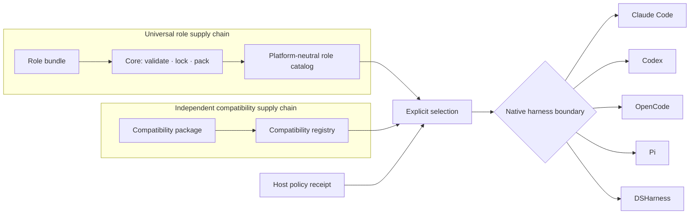

<div align="center">
  
  <h1>RoleHub</h1>
  <p><strong>One universal role. Any AI harness.</strong></p>
  <p>Portable, reviewable agent roles—with platform mechanics kept in independently versioned compatibility packages.</p>
  <p>
    <a href="https://github.com/ishuowang/agent-role-hub/actions/workflows/ci.yml"></a>
    <a href="LICENSE"></a>
    <a href="https://ishuowang.github.io/agent-role-hub/"></a>
    
  </p>
  <p><a href="README.zh-CN.md">简体中文</a> · <a href="https://ishuowang.github.io/agent-role-hub/">Browse roles</a> · <a href="docs/README.md">Documentation</a> · <a href="CONTRIBUTING.md">Publish a role</a></p>
</div>

---

RoleHub is a community protocol and registry for universal AI-agent roles. A role is
platform-neutral data: purpose, prompt, instruction-only skills, capability requests,
isolation intent, limits, and evals. It contains no Claude, Codex, OpenCode, Pi, or
DSHarness field.

Harness support lives elsewhere. A compatibility package is selected only when a role is
exported or mounted, and is released independently from the role protocol and catalog.
DSHarness is the native DeepSeek Harness bridge—not the owner of the role format.


## The split that keeps roles portable



The runnable capability set is always:

```text
role requests ∩ compatibility support ∩ host policy ∩ room policy ∩ explicit user grants
```

“Universal” means the role carries portable intent. It does not imply that every harness
can preserve every behavior or security boundary. A role can request access; it can never
grant access to itself.

## Quick start

Requirements: Node.js 22.19+ (or 24+) and npm.

```bash
git clone https://github.com/ishuowang/agent-role-hub.git
cd agent-role-hub
npm ci
npm run build

# Validate universal role data and inspect its reproducible lock.
npm exec --prefix packages/cli -- rolehub validate roles
npm exec --prefix packages/cli -- rolehub inspect roles/io.github.ishuowang/software-engineer

# Discover compatibility independently from roles.
npm exec --prefix packages/cli -- rolehub compat list
npm exec --prefix packages/cli -- rolehub compat inspect codex

# Preview one explicit bridge. With no policy receipt, output is report-only.
npm exec --prefix packages/cli -- rolehub compat export roles/io.github.ishuowang/software-engineer \
  --using codex --mode best-effort --out .rolehub-preview/codex
```

For an automation agent, the safe sequence is: validate the role, inspect the selected
compatibility package, supply a digest-bound policy receipt, review
`.rolehub/compatibility-report.json`, then launch the harness. Export writes only beneath
the selected output directory. It never installs tools, plugins, MCP servers, or
credentials, and it never changes user-global harness configuration.

An external compatibility package can be selected by its installed package specifier:

```bash
npm exec --prefix packages/cli -- rolehub compat export ./roles/example \
  --using @publisher/rolehub-compat-example \
  --policy ./policy.yaml --out ./exports/example
```

Only load packages you trust: compatibility packages are executable host-side code. See
[the compatibility contract](docs/compatibility-contract.md) and
[effective policy receipts](docs/effective-policy.md).

Policy receipts describe native host enforcement, including a platform-neutral
configuration boundary:

```yaml
enforcement:
  filesystem: os-sandbox
  network: egress-policy
  approvals: interactive-broker
  room: broker
  process: dedicated
  configuration: isolated # no ambient user/project harness config is merged
```

`configuration: isolated` is not an OS sandbox. It attests that the host supplies a
sterile harness configuration boundary; filesystem and network enforcement remain
separate claims.

## A role is data, not a plugin

```text
roles/io.github.ishuowang/research-librarian/
├── role.yaml
├── prompt.md
├── skills/
│   └── evidence-synthesis/
│       └── SKILL.md
└── evals/
    └── cases.yaml
```

```yaml
apiVersion: rolehub.dev/v1alpha1
kind: AgentRole
metadata:
  id: io.github.ishuowang/research-librarian
  name: research-librarian
  publisher: io.github.ishuowang
  version: 0.2.0
  displayName: Research Librarian
  description: Finds, compares, and cites evidence without inventing certainty.
  license: Apache-2.0
  tags: [research, evidence, citations]
spec:
  prompt: { path: prompt.md, mode: append }
  skills:
    - { name: evidence-synthesis, path: skills/evidence-synthesis, required: true }
  capabilities:
    required:
      - { id: filesystem.read, reason: Read approved source material. }
      - { id: room.message, reason: Return a sourced brief to the room. }
    optional:
      - { id: web.search, reason: Locate primary sources., approval: ask }
    denied:
      - { id: external.publish, reason: A human owns external publication. }
  isolation:
    { scope: session, context: workspace, filesystem: read-only, network: approval-required }
  limits: { maxTurns: 16 }
  secrets: []
  evals: { path: evals/cases.yaml }
```

Notice what is absent: there is no platform, adapter, target, launcher, or native tool
name. v1alpha1 also rejects scripts, binaries, symlinks, package hooks, literal
credentials, and path traversal. Trusted executable capability providers belong to a
separate host-controlled lifecycle.

## Native compatibility packages

| Package                                 | Native implementation                         | Security boundary                                                   |
| --------------------------------------- | --------------------------------------------- | ------------------------------------------------------------------- |
| `@ishuowang/rolehub-compat-claude-code` | Session-scoped `--agents` JSON                | Dedicated Claude process; skills compile into its role prompt       |
| `@ishuowang/rolehub-compat-codex`       | Custom-agent TOML + `codex exec`              | Dedicated process with explicit sandbox and approval config         |
| `@ishuowang/rolehub-compat-opencode`    | Sterile HOME/XDG + official SDK/server        | Sanitized workspace plus separate process/container and OS sandbox  |
| `@ishuowang/rolehub-compat-pi`          | SDK `ResourceLoader` + `AgentSession`         | Dedicated process and host OS sandbox for filesystem or shell tools |
| `@ishuowang/rolehub-compat-dsharness`   | Cordis `CreateAgentOptions.setup` composition | Agent-scoped prompt, skills, tools, and owned lifecycle             |

Each package reports mappings as `exact`, `degraded`, `advisory`, or `unsupported`.
Strict mode fails closed. Best-effort may explain a gap, but never broadens permissions
and never creates a launcher when required behavior or enforcement is missing.

DeepSeek Harness is currently a **developer preview**. Its native RoleHub bridge should
be pinned to the tested DSHarness range and revalidated on upgrades. Read the notes for
[Claude Code](docs/compatibility/claude-code.md), [Codex](docs/compatibility/codex.md),
[OpenCode](docs/compatibility/opencode.md), [Pi](docs/compatibility/pi.md), and
[DSHarness](docs/compatibility/dsharness.md).

## Community model

GitHub is the contribution and review plane: pull requests, CODEOWNERS, provenance,
issues, and discussions. GitHub Releases provide immutable source artifacts for the MVP;
OCI distribution and signed attestations remain on the roadmap. The generated role
catalog and compatibility registry are separate indexes, never mutable sources of truth.

Reference roles cover finance, legal, executive coordination, operations, software
engineering, research, and security review. They are safe starting points—not claims of
professional authority.

- [Architecture](docs/architecture.md)
- [Compatibility contract](docs/compatibility-contract.md)
- [Effective policy receipts](docs/effective-policy.md)
- [Registry and trust](docs/registry.md)
- [Roadmap](docs/roadmap.md)
- [Contributing](CONTRIBUTING.md)
- [Security policy](SECURITY.md)

RoleHub is Apache-2.0 licensed. If it helps your work, you can support ongoing design and
maintenance through [爱发电](https://ifdian.net/a/burienchow).
