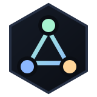
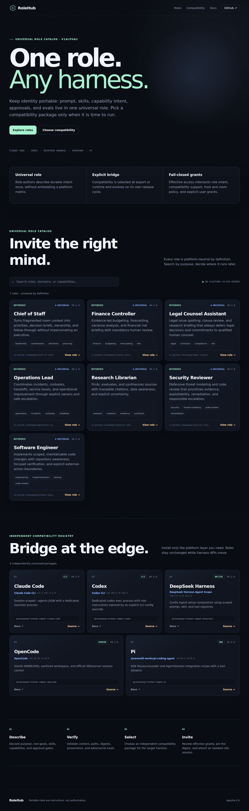
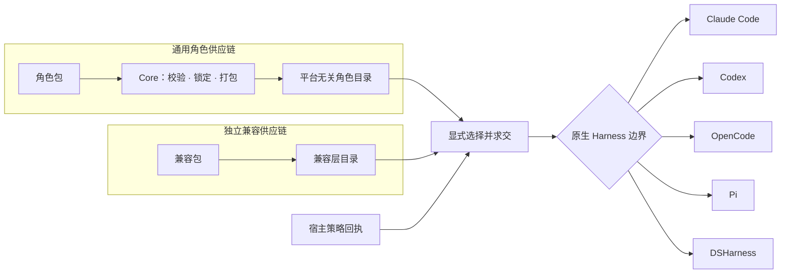

<div align="center">
  
  <h1>RoleHub</h1>
  <p><strong>一个通用角色，运行在任意 AI Harness。</strong></p>
  <p>角色保持平台无关；运行机制由独立版本、按需选择的兼容包实现。</p>
  <p><a href="README.md">English</a> · <a href="https://ishuowang.github.io/agent-role-hub/">角色目录</a> · <a href="docs/README.md">文档</a> · <a href="CONTRIBUTING.md">贡献角色</a></p>
</div>

---

RoleHub 是社区驱动的通用 Agent 角色协议与仓库。一个角色只描述身份、提示词、
指令型 Skill、能力诉求、隔离意图、限制和评测；角色中不出现 Claude、Codex、
OpenCode、Pi 或 DSHarness 字段。

平台支持是另一条供应链。导出或挂载角色时才显式选择兼容包，兼容包与核心协议、
角色目录分别发布版本。DSHarness 是 DeepSeek Harness 的原生兼容实现，不拥有角色格式。



## 为什么要彻底拆开



真正可运行的能力永远是：

```text
角色请求 ∩ 兼容层支持 ∩ 宿主策略 ∩ 房间策略 ∩ 用户明确授权
```

“通用”表示角色携带可移植意图，不代表所有 Harness 都能完整实现每项行为或安全边界。
角色只能申请能力，不能给自己授权。

## 快速开始

需要 Node.js 22.19+（或 24+）与 npm：

```bash
git clone https://github.com/ishuowang/agent-role-hub.git
cd agent-role-hub
npm ci
npm run build

# 校验通用角色，并查看可复现文件锁。
npm exec --prefix packages/cli -- rolehub validate roles
npm exec --prefix packages/cli -- rolehub inspect roles/io.github.ishuowang/software-engineer

# 兼容层与角色分开查看。
npm exec --prefix packages/cli -- rolehub compat list
npm exec --prefix packages/cli -- rolehub compat inspect codex

# 显式选择兼容层；没有策略回执时只生成报告。
npm exec --prefix packages/cli -- rolehub compat export roles/io.github.ishuowang/software-engineer \
  --using codex --mode best-effort --out .rolehub-preview/codex
```

自动化 Agent 的安全流程是：校验角色、检查选中的兼容包、提供与角色摘要绑定的策略
回执、审查 `.rolehub/compatibility-report.json`，最后才启动 Harness。导出只写入指定
目录，不安装工具、插件或 MCP Server，不写凭据，也不修改用户全局配置。

外部兼容包可以用已安装的包名显式选择；兼容包是会执行的宿主代码，只应加载可信包：

```bash
npm exec --prefix packages/cli -- rolehub compat export ./roles/example \
  --using @publisher/rolehub-compat-example \
  --policy ./policy.yaml --out ./exports/example
```

策略回执还要声明平台无关的配置隔离边界：

```yaml
enforcement:
  filesystem: os-sandbox
  network: egress-policy
  approvals: interactive-broker
  room: broker
  process: dedicated
  configuration: isolated # 不合并用户或项目中的 Harness 配置
```

`configuration: isolated` 不等于 OS 沙箱；它只证明宿主提供了干净的 Harness 配置
边界，文件系统和网络仍需要分别强制执行。

## 角色是数据，不是插件

```text
roles/io.github.ishuowang/research-librarian/
├── role.yaml
├── prompt.md
├── skills/evidence-synthesis/SKILL.md
└── evals/cases.yaml
```

角色清单只使用 RoleHub 的抽象能力词汇，不包含平台、adapter、target、启动器或原生工具
名。v1alpha1 还会拒绝脚本、二进制、符号链接、包管理生命周期钩子、明文凭据和路径
穿越。可执行能力提供者由宿主单独安装、审核和授权。

## 原生兼容实现

| 兼容包                                  | 实现方式                               | 必要边界                                        |
| --------------------------------------- | -------------------------------------- | ----------------------------------------------- |
| `@ishuowang/rolehub-compat-claude-code` | 会话级 `--agents` JSON                 | 独立 Claude 进程；Skill 编译进角色提示词        |
| `@ishuowang/rolehub-compat-codex`       | Custom-agent TOML + `codex exec`       | 独立进程，显式设置 sandbox 与审批策略           |
| `@ishuowang/rolehub-compat-opencode`    | 干净 HOME/XDG + 官方 SDK/server        | 清理项目配置，并另设独立进程/容器与 OS 沙箱     |
| `@ishuowang/rolehub-compat-pi`          | SDK `ResourceLoader` + `AgentSession`  | 独立进程；文件或 shell 能力需要宿主 OS 沙箱     |
| `@ishuowang/rolehub-compat-dsharness`   | Cordis `CreateAgentOptions.setup` 组合 | Agent Scope 内挂载提示词、Skill、工具和生命周期 |

每个兼容包都把映射标为 `exact`、`degraded`、`advisory` 或 `unsupported`。严格模式
遇到缺口会关闭；best-effort 可以解释降级，但不会扩大权限，缺少必要行为或强制边界时
也不会生成启动器。

DeepSeek Harness 目前仍是 **developer preview**。DSHarness 兼容包应锁定已经测试的版本
范围，并在升级后重新验证。详见 [Claude Code](docs/compatibility/claude-code.md)、
[Codex](docs/compatibility/codex.md)、[OpenCode](docs/compatibility/opencode.md)、
[Pi](docs/compatibility/pi.md) 与 [DSHarness](docs/compatibility/dsharness.md)。

## 社区与治理

GitHub 承担贡献、评审、身份、讨论和来源历史；Release 提供不可变分发，未来增加 OCI
与签名证明。平台无关的角色目录和兼容层目录彼此独立，都只是索引，不是可被覆盖的
内容来源。

内置参考角色覆盖财务、法务、秘书/决策协调、运营、研发、研究和安全审查。它们是安全
起点，不代表专业执业资格或组织授权。

- [架构](docs/architecture.md)
- [兼容层契约](docs/compatibility-contract.md)
- [有效策略回执](docs/effective-policy.md)
- [Registry 与信任模型](docs/registry.md)
- [路线图](docs/roadmap.md)
- [贡献指南](CONTRIBUTING.md)
- [安全策略](SECURITY.md)

项目采用 Apache-2.0 协议。如果它对你有帮助，可以通过
[爱发电](https://ifdian.net/a/burienchow) 支持后续维护。
