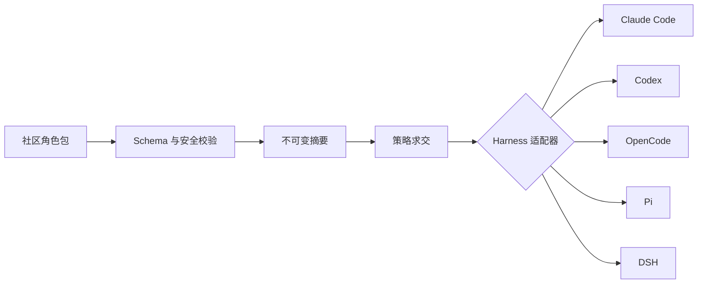

<div align="center">
  
  <h1>RoleHub</h1>
  <p><strong>一个角色，运行在任意 AI Harness。</strong></p>
  <p>面向 Claude Code、Codex、OpenCode、Pi、DSH 以及未来运行时的可移植、可审查 Agent 角色协议。</p>
  <p><a href="README.md">English</a> · <a href="https://ishuowang.github.io/agent-role-hub/">角色目录</a> · <a href="docs/README.md">文档</a> · <a href="CONTRIBUTING.md">贡献角色</a></p>
</div>

---

RoleHub 是一个社区驱动的 Agent 角色协议与仓库。每个角色把提示词、只含指令的
Skill、能力诉求、审批点、隔离要求、运行限制和评测用例放在同一个可验证的数据包里；
适配器再把这份来源编译给不同 AI Harness。

DSH 只是其中一种实现。核心协议不属于任何厂商，也不会把 Claude Code、Codex、
OpenCode 或 Pi 的私有字段反向污染公共规范。


## 它解决什么问题

目前大量“角色”被锁在某个产品的全局提示词、Skill 目录或插件中。复制到另一个工具时，
权限语义、隔离范围和行为约束很容易悄悄丢失。RoleHub 把角色意图与运行机制拆开：



最终能力永远是：

```text
角色请求 ∩ 适配器支持 ∩ 宿主策略 ∩ 房间策略 ∩ 用户明确授权
```

角色只能“申请”能力，不能给自己授权。

## 快速开始

需要 Node.js 22+ 与 npm：

```bash
git clone https://github.com/ishuowang/agent-role-hub.git
cd agent-role-hub
npm ci
npm run check

# 查看角色及其可复现文件锁
npm exec -- rolehub inspect roles/io.github.ishuowang/software-engineer

# 预览兼容性，不修改用户全局配置；没有有效策略回执时只生成报告
npm exec -- rolehub export roles/io.github.ishuowang/software-engineer \
  --target codex --mode best-effort --out .rolehub-preview/codex
```

运行目标 Harness 之前，请先检查生成的 `rolehub-export.json`。导出过程不会自动安装
工具、插件、MCP Server，也不会写入凭据。

要生成可启动配置，还必须显式传入 `--policy <receipt.yaml>`。策略回执与准确的角色包
摘要和目标 Harness 绑定，记录用户授权，以及宿主实际提供的文件系统、网络、审批、
房间和进程隔离。缺失或不匹配时，即使是 best-effort 也只输出报告。详见
[有效策略回执](docs/effective-policy.md)。

## 角色包结构

```text
roles/io.github.ishuowang/research-librarian/
├── role.yaml               # 身份、能力诉求、隔离与限制
├── prompt.md               # 可移植角色提示词
├── skills/
│   └── evidence-synthesis/
│       └── SKILL.md        # v1alpha1 只允许指令内容
└── evals/
    └── cases.yaml          # 正向与对抗评测
```

v1alpha1 会拒绝脚本、二进制、符号链接、包管理生命周期钩子、明文凭据和路径穿越。
可执行能力提供者由宿主单独安装、审核和授权，不放进社区角色包。

## 当前适配器

| 目标        | 默认输出                           | Skill 策略               | 主要边界                              |
| ----------- | ---------------------------------- | ------------------------ | ------------------------------------- |
| Claude Code | 会话级 `--agents` JSON             | 编译进角色提示词         | Native Team 能应用的字段更少          |
| Codex       | 项目级 `.codex/agents/<role>.toml` | 编译提示词，避免目录污染 | 父会话实时 sandbox/审批覆盖仍会生效   |
| OpenCode    | 独立 `OPENCODE_CONFIG_DIR`         | 原生显式 Skill           | 配置隔离不等于系统沙箱                |
| Pi          | 每个房间成员一个 RPC/SDK 进程      | 原生 `--skill` 路径      | 没有原生子 Agent、MCP、审批 UI 或沙箱 |
| DSH         | Agent Scope Composition            | Agent 级 Skill Registry  | 冷恢复时必须重挂载固定摘要的角色      |

每次导出都会把映射标记为 `exact`、`degraded`、`advisory` 或 `unsupported`。
严格模式遇到无法保留的必要边界会直接失败；best-effort 只会显式降级，不会扩大权限，
缺少必要能力时也不会生成启动器。

## 社区与治理

GitHub 负责贡献、代码审查、身份、讨论和源历史；Release 提供不可变分发，未来再增加
OCI 与签名证明。静态目录只是索引，不是可随意覆盖的角色来源。

内置参考角色覆盖财务、法务、秘书/决策协调、运营、研发、研究和安全审查。它们是安全
起点，不代表任何专业执业资格或组织授权。

- [架构](docs/architecture.md)
- [适配器契约](docs/adapter-contract.md)
- [有效策略回执](docs/effective-policy.md)
- [Registry 与信任模型](docs/registry.md)
- [路线图](docs/roadmap.md)
- [贡献指南](CONTRIBUTING.md)
- [安全策略](SECURITY.md)

项目采用 Apache-2.0 协议。如果它对你有帮助，可以通过
[爱发电](https://ifdian.net/a/burienchow) 支持后续维护。
