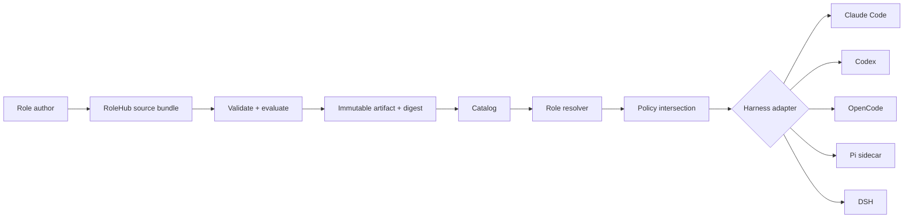

# Architecture

RoleHub separates a role's intent from the mechanics of any one AI harness.



## Four planes

### Role plane

A role describes identity, instructions, skills, requested and denied capabilities,
approval boundaries, isolation intent, limits, compatibility, and evals. It contains no
runtime authorization and no executable provider implementation.

### Registry plane

GitHub provides contribution, review, identity, discussion, and source history. Releases
and OCI artifacts provide immutable machine distribution. The generated catalog is a
small signed/indexable view over those artifacts, not the source of role content.

### Policy plane

The resolver computes effective capabilities before a role is materialized:

```text
role request
  ∩ adapter support
  ∩ harness policy
  ∩ room/session policy
  ∩ explicit user grant
= effective capability set
```

A missing required capability is an incompatibility, not an invitation to broaden
access. A denied capability always remains denied.

The CLI accepts that result only as a separate effective-policy receipt bound to one
role bundle digest and one harness target. The receipt is trusted host input, never role
content. Without it, exports are compatibility previews and contain no runnable harness
configuration.

### Runtime plane

The adapter renders or mounts a verified role into the smallest isolation scope the
harness supports. A runtime may use native subagents, a dedicated child session, a
sidecar process, or a generated project configuration. These are implementation details;
they do not alter the source role.

## Invite and leave lifecycle

```mermaid
sequenceDiagram
  participant U as User / room leader
  participant H as RoleHub
  participant C as Catalog
  participant A as Harness adapter
  participant R as Role session

  U->>H: invite publisher/role@range
  H->>C: resolve range to immutable digest
  H->>H: verify schema, archive, hashes, provenance
  H->>A: plan(role, host policy)
  A-->>H: exact mappings + warnings + required grants
  U->>H: approve effective grants
  H->>R: materialize pinned role
  R-->>U: joined with role lock
  U->>H: leave role
  H->>R: stop admission, interrupt or drain
  H->>R: revoke grants and dispose role scope
  H-->>U: left; audit history retained
```

Leaving prevents future capability use. It cannot erase prompts, tool results, or role
content already present in a model transcript. A workload that requires a clean identity
boundary must start a new session.

## Capability vocabulary

RoleHub uses abstract capability ids rather than vendor tool names. Initial families are:

- `filesystem.read`, `filesystem.write`
- `shell.execute`
- `network.fetch`, `web.search`, `browser.operate`
- `source-control.read`, `source-control.write`
- `issues.read`, `issues.write`
- `room.message`, `room.delegate`
- `memory.read`, `memory.write`
- `secrets.use`
- `external.publish`, `money.spend`, `legal.commit`

Adapters own the translation to concrete tools and permission settings. Tool names alone
are not sufficient proof that a harness enforces a capability.

## No universal lowest common denominator

Harnesses expose different composition and security boundaries. RoleHub therefore keeps
the rich source role and produces a compatibility report for each target. The report
classifies mappings as:

- **exact** — target semantics enforce the source intent;
- **advisory** — target receives instructions but cannot enforce the boundary;
- **degraded** — a documented subset is preserved;
- **unsupported** — no safe mapping exists.

Strict export refuses unsupported required fields and unsafe advisory permission
boundaries. Best-effort export is useful for exploration, but it always writes the report
beside generated files.
