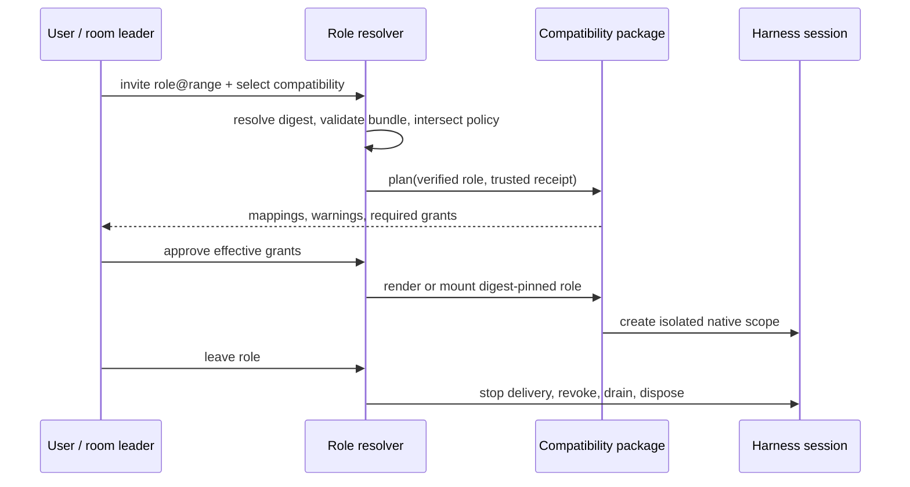

# Architecture

RoleHub treats a role as universal data and a harness bridge as independently versioned,
trusted host code. The two meet only after explicit selection at export or runtime.

```mermaid
flowchart TB
  subgraph RolePlane[Universal role plane]
    A[Role author] --> S[Role source bundle]
    S --> V[@ishuowang/rolehub-core]
    V --> L[Validated lock + immutable digest]
    L --> RC[Platform-neutral role catalog]
  end

  subgraph CompatPlane[Compatibility plane]
    B[Compatibility maintainer] --> P[Independent compatibility package]
    P --> CC[Separate compatibility registry]
  end

  RC --> R[Resolver]
  CC --> R
  E[Host-owned policy receipt] --> R
  R --> I[Capability intersection + mapping report]
  I --> H{Native harness boundary}
  H --> CL[Claude Code --agents]
  H --> CX[Codex custom-agent + exec]
  H --> OC[OpenCode SDK/server]
  H --> PI[Pi SDK session]
  H --> DS[DSHarness Agent scope]
```

## Universal role plane

A role describes identity, instructions, instruction-only skills, requested and denied
abstract capabilities, approval intent, isolation intent, limits, secret references, and
evals. It contains no runtime authorization and no executable provider implementation.

Most importantly, it contains no platform metadata: no harness id, compatibility package,
target version, native tool name, config path, or launcher. The role catalog can therefore
be generated without any compatibility package installed and must remain byte-identical
when compatibility packages change.

## Compatibility plane

A compatibility package translates one verified role into one native harness mechanism.
It has its own package name, version, supported harness range, capability matrix, tests,
and release cadence. It may generate static files or mount scoped runtime state, but it
does not edit the role or make itself part of the role catalog.

The built-in implementations deliberately use native extension surfaces:

- Claude Code: ephemeral session `--agents` JSON in a dedicated process;
- Codex: custom-agent TOML launched through a dedicated `codex exec` process;
- OpenCode: sterile HOME/XDG paths, a sanitized workspace, and the official SDK/server;
- Pi: SDK `ResourceLoader` and `AgentSession`, protected by a host OS sandbox; and
- DSHarness: Cordis Agent-scope composition through `CreateAgentOptions.setup`.

Third-party compatibility packages are explicitly selected by installed package
specifier. They are executable host code and are never auto-installed or discovered from
a role.

## Policy plane

The host computes effective capabilities before anything runnable is materialized:

```text
role request
  ∩ compatibility package support
  ∩ harness/host policy
  ∩ room/session policy
  ∩ explicit user grant
= effective capability set
```

A missing required capability is an incompatibility, not permission to broaden access.
A denied capability remains denied. “Universal role” describes portable intent; it does
not claim a universal lowest-common-denominator runtime.

The CLI accepts the result only as a separate effective-policy receipt bound to one role
bundle digest and one compatibility id. The receipt is trusted host input, never role
content. Without it, export is a report-only preview and contains no launcher.

The receipt separately describes filesystem, network, approvals, room, process, and
configuration enforcement. `configuration: isolated` means ambient user/project harness
configuration cannot be merged; it does not claim an OS sandbox. This distinction matters
for OpenCode, whose strict bridge requires a sterile HOME/XDG environment and a sanitized
workspace as well as the appropriate process and filesystem boundaries.

## Runtime plane

The selected package renders or mounts a verified role into the smallest native scope the
harness can enforce. Configuration scoping is not automatically a security sandbox: the
host must still supply the process, filesystem, network, room, and approval boundaries
claimed in the receipt.

DeepSeek Harness is currently a **developer preview**. The DSHarness package uses its
native Agent/Cordis scope, but callers must pin the supported release-candidate range and
revalidate behavior after upgrades.

## Invite, resume, and leave



Cold resume must verify the same immutable role digest and compatibility version before
rehydrating scoped state. Leaving prevents future capability use; it cannot erase content
already present in a model transcript. Work requiring a clean identity boundary starts a
new session.

## Capability vocabulary

Roles use abstract capability ids, including:

- `filesystem.read`, `filesystem.write`, `shell.execute`;
- `network.fetch`, `web.search`, `browser.operate`;
- `source-control.read`, `source-control.write`;
- `issues.read`, `issues.write`;
- `room.message`, `room.delegate`;
- `memory.read`, `memory.write`;
- `secrets.use`; and
- `external.publish`, `money.spend`, `legal.commit`.

Compatibility packages own translation to native tools and permission settings. Merely
matching a tool name is not proof that a harness enforces the requested boundary.

Every material mapping is classified as `exact`, `degraded`, `advisory`, or
`unsupported`. Strict mode fails closed when required behavior or enforcement cannot be
preserved. Best-effort remains explicit and report-only when a launcher would be unsafe.
