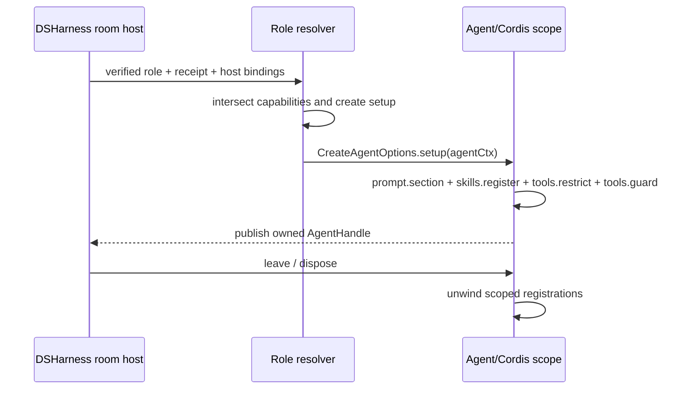

# DeepSeek Harness compatibility

Package: `@ishuowang/rolehub-compat-dsharness`
Compatibility id: `dsharness`
Tested target: DeepSeek Harness Agent Scope `>=0.1.0-rc.6 <0.2.0`

The DeepSeek implementation is built directly on **DSHarness**. This package does not
translate roles through another CLI format. It mounts a verified role into a native
Cordis Agent scope through `CreateAgentOptions.setup`.

> DeepSeek Harness is currently a **developer preview**. Pin the tested release-candidate
> range, review upstream changes, and rerun compatibility tests before every upgrade.

This document describes the reusable compatibility library. The installable
[`dsh-rolehub-bridge`](https://github.com/ishuowang/dsh-rolehub-bridge) Profile Bundle adds
remote Hub discovery, digest-pinned continuable role Sessions, an additive native picker,
and optional Agent Team Room attachment while keeping this package reusable by other Hosts.

## Native composition

`createDsharnessSetup(role, options)` returns the trusted setup callback used while the
Agent scope is still unpublished. Within that scope it:

1. registers a digest-namespaced system-prompt section;
2. registers each verified instruction-only skill in the Agent skill registry;
3. restricts the Agent tool registry to host-resolved native bindings; and
4. lets the Agent/Cordis scope own automatic teardown with its `AgentHandle`.

The role stays platform-neutral. Abstract-capability-to-tool bindings are supplied by the
trusted DSHarness host, never by `role.yaml`.



## Export and runtime handoff

```bash
rolehub compat inspect dsharness
rolehub compat export ./roles/example \
  --using dsharness \
  --policy ./example.dsharness.policy.yaml \
  --bindings ./dsharness-bindings.json \
  --scope session --out ./exports/example-dsharness
```

Output includes:

```text
dsharness/role-composition.json       # digest-pinned native composition
dsharness/prompt.md                   # verified prompt material
dsharness/skills/<name>/SKILL.md      # verified scoped skills
rolehub-dsharness-runtime.json        # setup export and service requirements
.rolehub/compatibility-*.json
```

Example host-owned bindings:

```json
{
  "filesystem.read": ["workspace.read", "workspace.search"],
  "memory.read": ["role_memory.read"],
  "room.message": []
}
```

The empty `room.message` list is intentional: room delivery is a host broker capability,
not a model tool. Memory is different: `memory.read` and `memory.write` require a non-empty,
valid host binding to a scoped memory provider/tool. A policy grant without that evidence
never makes memory effective. Missing evidence degrades an optional memory request and is
unsupported for a required one.

The binding name is trusted host evidence that a reviewed provider exists and is scoped;
it is not authorization supplied by the role. The role request, effective-policy grant,
host binding, and runtime guard must all agree before the provider becomes callable.

## Capability and lifecycle rules

- The setup callback receives only the effective capabilities from the digest-bound
  receipt.
- Native tool names never enter the universal role or role catalog.
- `memory.read` and `memory.write` enter `effectiveCapabilities` only after the trusted
  host supplies a valid, non-empty provider binding; the bound provider is covered by the
  same monotonic tool guard.
- Agent scope provides lifecycle isolation; roles requesting process isolation additionally
  require a dedicated DSHarness process from the host.
- Invite publishes the `AgentHandle` only after all scoped registrations succeed.
- Cold resume verifies the role lock and reruns setup before accepting messages.
- Leave stops delivery, drains or aborts work, revokes host providers, and disposes the
  handle so Cordis unwinds prompt, skill, and tool registrations.
- A missing locked bundle, provider, binding, or policy boundary fails closed.

## Upstream references

- [DeepSeek Harness repository](https://github.com/deepseek-ai/deepseek-harness)
- [First Cordis plugin tutorial](https://github.com/deepseek-ai/deepseek-harness/blob/master/docs/cordis-tutorial/01-first-plugin.md)
- [DSHarness presets](https://github.com/deepseek-ai/deepseek-harness/tree/main/packages/preset)
